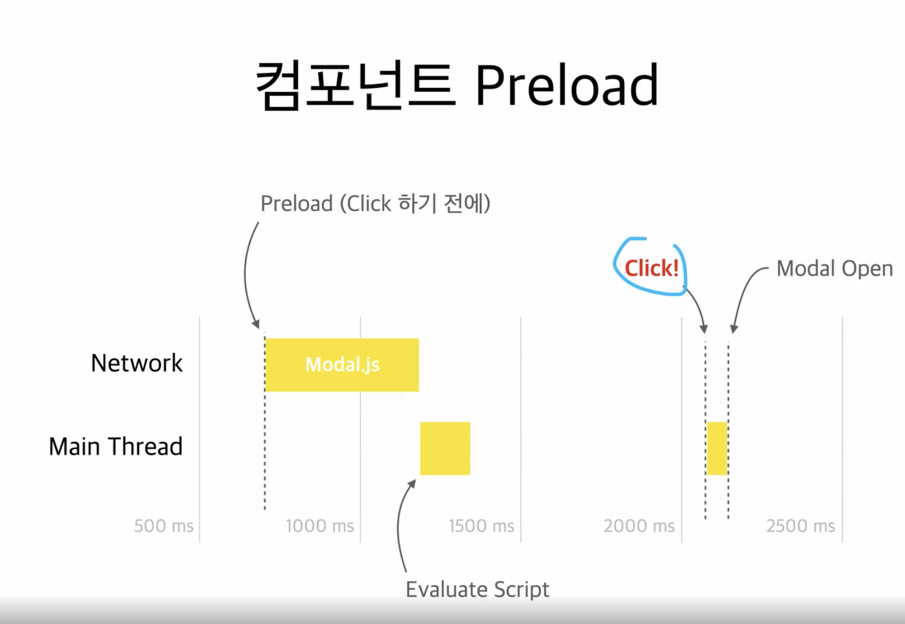
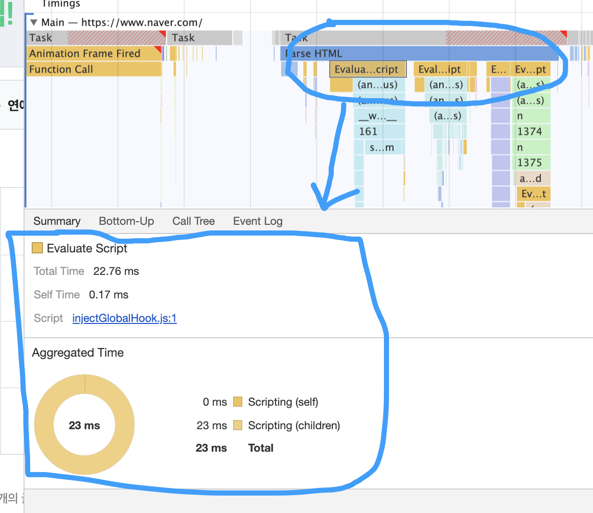

## 2-1) 실습 내용 & 분석 툴 소개

### 실습 내용

- 애니메이션 최적화 (Reflow, Repaint)

  - 애니메이션 잘못 사용하면 버벅이면서 사용자 경험을 안좋게 마든다

- 컴포넌트 Lazy Loading (Code Splitting)

  - 앞서 배운 페이지 단위가 아닌, 한 페이지 안에서의 일반 컴포넌트를 Lazy Loading 한다

- 컴포넌트 Preloading

  - 분할한 코드를 그때 그때 부르는 것 아니라 미리 코드를 불러와서 컴포넌트에 대한 로딩을 최적화 하는 방법

- 이미지 Preloading

  - 이미지를 pre load해서 이미지가 화면에 더 빨리 나타날 수 있도록 하는 방법

- 애니메이션 -> 렌더링 성능 최적화

- 컴포넌트 Lazy Loading (Code Splitting), 컴포넌트 Preloading, 이미지 Preloading -> 로딩 성능 최적화

### 분석 툴

- 크롬 Network 탭

- 크롬 Performance 탭

- webpack-bundle-analyzer

<br/>

---

## 2-2) 서비스 탐색 & 코드 분석

---

<br/>

## 2-3) 애니메이션 분석 (Reflow와 Repaint 이론)

- Performance 탭의 CPU를 6x로 설정하면, 바를 눌렀을 때 버벅거리는 jank 현상이 나타나는 것을 확인할 수 있다

- 그리고 레코드 누른 다음에 클릭해주면, 훨씬 더 버벅이는 것을 확인할 수 있다

- 왜 이렇게 느린지 Element 탭을 눌러서 요소를 확인해 본다

- 바를 클릭할 때마다 width 값이 바뀌는 애니메이션이 일어나는 것을 확인할 수 있다.

- 쟁크 현상

  - 브라우저는 초딩 60 Frame으로 렌더링 해야 한다

  - 이렇게 버벅거리는 것은 초당 60 Frame으로 그리지 못했기 때문에 발생하는 현상이다

    - 예를들어 초당 30 Frame 또는 20 Frame으로 ㄱ려주면 애니메이션이 버벅이는 현상인 쟁크가 발생하게 된다

  - 그러면 브라우저는 왜 60 Frame을 제대로 그리지 못하는 것을까 ?

- 브라우저 렌더링 과정

  - DOM + CSSOM -> Render Tree -> Layout -> Paint -> Composite

- DOM + CSSOM

  - HTML과 CSS가공해서 DOM과 CSSOM이라는 두가지 형태의 트리구조를 바꾸어준다

  - DOM은 요소들 간의 관계를 트리 구조로 만든 것

  - CSSOM 각 요소의 스타일들을 트리 구조로 만든 것

  - DOM과 CSSOM을 조합해서 최종적으로 렌더 트리를 만들게 된다

  - 렌더트리는 요소에 대한 컨텐츠와 스타일을 가지고 있고 브라우저는 Layout이라는 단계로 넘어가게 된다

- Layout

  - 위치나 요소의 크기등을 계산해서 어느 위치에 요소가 있어야 하는지, 어느정도의 사이즈로 요소가 있어야 되는지와 같이 말 그대로 화면의 레이아웃을 잡는다

- Paint

  - 이렇게 그려진 레이아웃 위에 페인트를 한다

  - 즉 Background나 텍스트 Color, Box-shadow와 같은 색을 칠해 넣는다.

- Composite

  - 각 레이어를 합성하는 단계

  - 브라우자기 화면에 그릴 때 Layout, Paint 단계를 거칠 때 각 레이어로 쪼개서 진행이 된다

  - 그리고 여러개로 쪼개진 레이어들을 하나로 합쳐서 최종적인 화면을 그리는게 Composite 단계

- 이 저네적인 과정을 Critical Rendering Path (Pixel Pipeline) 이라고 한다

- 스타일이 변경되는 경우, 이 변화된 내용을 가지고 DOM+CSSOM 부터 모든 과정을 거치게 된다

- 그러니까 애니메이션 관점에서는 초당 60 프레임, 0.016초라는 시간안에 화면을 보여주어야 하는데, 이 짭은 시간 동안 이 많은 단계를 거치려다 보니 브라우저가 일부 화면을 생략하게 되어서 버벅거리는 것 처럼 보이는 것이다

- Performance 탭에서 CPU: 6x slow donw으로 설정한 다음 Record를 실행한 다음 바를 클릭해서 애니메션이 코드가 실행되도록 한다.

- 그리고 나서 결과를 확인해보면 Animation 항목에서 바 형태가 나타난 것을 보고 애니메이션이 일어난 것을 확인할 수 있다

- 그리고 Animation 아래 Timings는 리액트에서 실행한 함수를 보여주는데, 바를 클릭할 때 마다 함수가 실행된 것을 확인할 수 있다

- 위에 있는 Frame 항목에서는 화면이 그려지는 것을 확인할 수 있다

- 그리고 아래 Main 항목을 통해 Animation이 일어날 때 마다 Layout, Paint, Composite이 일어난 것 또한 확인할 수 있다

- 이 때 전체적으로 Frame 항목을 확대해보면 세로 점선이 있는데 이 순간에 화면이 노출되어야 한다는 것이다

- 하지만 Main 항목을 보면 브라우저는 아직 Composite Layer를 하고 있고 Frame 항목에서는 아직 화면이 없다

- 정상적이라면 점선 전에 Composite Layer까지 작업이 끝나고 작업이 끝난 화면을 보여주어야 했다.

- 하지만 작업이 늦게 끝났기 때문에, 점선 부분에서는 작업이 끝나기 이전 화면을 보여주고 그 이후 작업이 완료된 화면은 누락 되었다

- 이 작업을 미리 땡겨서 할 수 있는 방법은 브라우저에게 부담을 덜 주는 방식으로 애니메이션을 구현하면 된다

- 비용이 많이드는 Layout과 Paint 단계를 건너 뛰는 것이다

- Reflow

  - width, height가 변경되는경우 DOM+CSSOM 부터 모든 단계가 재실행되는데 이를 reflow라고 한다

- Repaint

  - color, background-color가 변경되는 경우, 어쨋든 CSS가 변경되었으니 DOM과 CSSOM다시 만들고 Render Tree를 만들게 된다

  - 하지만 색깔이 변경되었기 때문에 위치나 크기가 변경되지 않았기에 Layout 단계는 생략이 되고, Paint, Composite 단계만 진행된다

  - Layout 단계가 생략되었으니 Reflow보다는 빠르다

- Reflow와 Repaint 단계를 모두 건너뛰는 방법이 있다 (GPU 도움 받기)

  - GPU의 도움을 받아서 Reflow와 Repaint 단계를 모두 피한다

  - transform이다 opacity 같이 GPU가 관여할 수 있는 속성을 변경시키면 Layout과, Paint 단계가 생략이 된다

- 현재 애니메이션이 width와 height를 변경하고 있었기 때문에 reflow 가 일어나서 jank 현상이 일어났던 것

- 이것을 빠르게 하기 위해서는 Reflow를 일어나지 않도록 처리해준다

---

- Q. textContent 변경하면

  - innerText 를 사용해서 태그 내부의 글자를 변경한다면. DOM -> renderTree -> composition 인가요?

  - 아니면 전플로우 인가요 리페인트 인가요..

- A. innerText 의 변경은 어떤 렌더링 과정을 거치게 되는지 질문해주셨는데요.

  - 결론을 바로 말씀드리면, 모든 과정을 거치는 reflow가 일어납니다.

  - 그 이유는 innerText를 수정하는 것은 DOM 요소들의 사이즈에 영향을 미칠 수 있는 작업이기 때문입니다.

  - 아래 사이트는 어떤 작업 또는 css 요소가 reflow 또는 repaint를 일으키는지를 정리한 사이트입니다.

    - https://gist.github.com/paulirish/5d52fb081b3570c81e3a

    - https://csstriggers.com/

- Q. paint 단계 질문

  - 안녕하세요. paint단계에 대해 질문이 있습니다.

  - paint단계에서는 layout단계에서 크기와 위치가 계산된 것들을 영역별로 쪼개서 레이아웃을 만드는 것으로 알고 있는데 강의에서처럼 색을 칠하고 레이아웃도 만든다고 생각을 하면 될까요?

- A. layout과 paint 과정에 대해서 질문을 주셨는데요,

  - 우선 layout 과정에서는 요소들의 위치, 사이즈 등을 결정하고,

  - 그것을 기준으로 paint 단계에서는 스타일(색상, 테두리 등)을 입힙니다.

  - 말씀하신, paint 단계에서 레이아웃을 만든다는 말이 정확히 어떤 의미인지는 모르겠으나, 요소의 위치와 사이즈를 말씀하시는 거라면, 그 작업은 paint가 아니라 layout에서 이루어 집니다.

  - Q. 답변 감사합니다. 질문의 의도는 composite 단계에서 일어나는 레이아웃들을 차곡차곡 쌓는 과정에서 사용되는 레이아웃들이 어느 단계에서 만드는지에 대한 질문이였습니다.

  - A. Layout 단계 이후 Update layer tree 단계가 있습니다. 이 때 layer들을 나누게 되고, paint 단계를 거칩니다.

    - 참고: https://developers.google.com/web/updates/2018/09/inside-browser-part3?hl=ko#%EB%A0%88%EC%9D%B4%EC%96%B4%EC%97%90_%EB%8C%80%ED%95%9C_%EA%B3%A0%EC%B0%B0

---

## 2-4) 애니메이션 최적화

- 코드 수정 후, performance 탭에서 record해서 보면 확인해보면 이전과 비교했을 때 성능 개선된 것 확인할 수 있다

- Q. gpu 가속 처리에 대해 궁금한것

  - 다름이 아니라 이번편, 전편에서 reflow ,repaint 를 지양하기 위해 gpu 에 할일을 위임하여 성능의 최적화를 한다고 알려주셨는데요.

  - 브라우저 단에서 랜더링을 하다가,

    1. layout 단계 이전에 gpu에 render dom 데이터를 어떤 형태로든 보내고,

    2. gpu는 받은 dom 데이터를 어떤식으로든 가공한 후에

    3. gpu 자원 사용하여 랜더링 (멀티 쓰레딩)

  - 하는 형태인것 같은데

  - 이런 형태라면 분명 브라우저-gpu 간 데이터가 오고가는 사이에서의 딜레이와 부하가 있어서 부담이 될텐데

  - 단순 reflow 보다 부담이 적은 이유가 무엇일까요?

  - 혹시 관련하여 어떤 키워드로 검색해야 원하는 결과를 얻을수있을지 ㅜㅜ 답변 부탁드립니다. 감사합니다.

- A. GPU를 사용하는 상황에서 데이터 통신에 대한 부하가 걸리지는 않는지 질문을 주셨는데요.

  - 브라우저가 GPU에 작업을 위임할 때, 흔히 우리가 생각하는 네트워크 통신처럼 시간이 걸는게 아니라 굉장히 빠른 프로세스 간의 통신이 이뤄집니다.

  - 또한, 크롬 브라우저에서는 이미 GPU 프로세스를 포함한 여러 역할을 담당하는 프로세스들이 동작하고 있기 때문에 별도의 오버헤드 없이 해당 프로세스들 끼리 데이터를 주고 받을 수 있게 됩니다.

  - 즉, CPU에서 처리함으로써 떨어지는 성능에 비하면 거의 무의미한 수준의 비용이기 때문에 오히려 빨라지는 것입니다.

  - 참고하실 수 있도록 도움되는 링크를 알려드리겠습니다.

    - https://dev.opera.com/articles/ko/css-will-change-property/

    - https://d2.naver.com/helloworld/2922312

    - https://developers.google.com/web/updates/2018/09/inside-browser-part3#raster_and_composite_off_of_the_main_thread

---

## 2-5) 컴포넌트 Lazy Loading (Code Splitting)

```shell

$ npx cra-bundle-analyzer

```

- 명령어 실행해서 확인해보면 image-gallery.js이 main.js 파일에 포함되어 있는 것을 확인할 수 있다

- 하지만 이 라이브러리는 모달 창이 열렸을 때 이미지를 처리하기 위한 라이브러리이기 때문에 처음 페이지에서는 모듈이 당장 필요가 없다

- 사이즈가 많이 크지는 않지만 성능 최적화를 위해서 코드를 분할해준다

- 코드 수정후 네트워크 탭을 열어서 보면, 모달 창 열 때 두개의 js 파일이 추가적으로 다운받아지는 것을 확인할 수 있다

- 다시 `npx cra-bundle-analyzer` 명령어를 실행해보면 image-gallery.js 파일이 분리된 것을 확인할 수 있다

- 그리고 추가적인 이미지 모달에 관련된 소스가 분리되어 있는데 이것은 cra 기본적인 설정 때문에 라이브러리와 우리가 작성한 modal 소스 파일이 분리되어 있는 것이다

---

- Q. 번들파일 질문

  - 레이지 로딩이 된 이후에 budle-analyzer상태에 대한 질문이 있습니다.

  - 저희가 구현한 코드(src)가 레이지로딩에 의해서 분리가 된 것 같습니다. 근데 node_modules에 포함되어있던 image-gallery.js가 모달컴포넌트에서만 필요할 것 같은데 공통적으로 사용되는 budler파일에 저장이 된 이유가 있나요?

  - cache에 의해서 어차피 한번만 들고오면 되기 때문에 공통으로 사용되는 bundler파일에 넣어진 것인지 궁금합니다.

- A. 번들 파일과 관련하여 질문을 주셨는데요,

  - 우선 아셔야 할 것은 원래 자바스크립트 파일들(모든 라이브러리와 소스코드들) 따로따로 분리되어 있습니다.

  - 그래서 번들러 없이 코드를 실행하게 되면 모든 파일들을 브라우저에서 전부 불러와야 합니다.

  - 당연히 이러한 방식은 여러가지 면에서 비효율적입니다.

  - 그래서 번들러가 등장합니다. 여러 소스코드를 각각 로드할 필요없도록 하나의 파일로 합쳐줍니다.

  - (모듈들을 여러 파일로 쪼개서 사용하는 리액트나 요즘 프레임워크들의 경우 더욱 효율적입니다)

  - 하지만 서비스의 구조가 커지다 보니 번들 사이즈도 커지고 초기 로딩속도가 저하되는 단점이 발생합니다.

  - 그래서 이때 코드 분할을 하여 초기 로딩속도를 개선하는 겁니다.

  - 즉, 모든 코드들(image-gallery)이 합쳐져 있는 것이 효율적이기 때문에 합쳤는데, 문제가 있어 일부만 다시 쪼갠 것입니다

  - Q. 번들러의 필요성과 왜 쪼개는 지에 대한 이유는 알고 있습니다.

    - 다만 lazy로딩이후에 bundle-analyzer의 상태에서 어떤 파일이 어떤 코드를 의미하는 지 조금 헷갈립니다.

    - 이미지 모달 컴포넌트에서 image-gallery.js를 들고 있으면 되는데 굳이 다른 번들러 파일에 있는지에 대한 질문이였습니다.

  - A. 아하 제가 이해를 잘못했군요.

    - 그건 create-react-app의 기본 webpack 설정 때문에 그렇습니다.

    - 기본적으로 cra의 webpack은 node_modules 라이브러리들과 서비스 코드(src)를 구분하여 번들링 합니다.

---

## 2-6) 컴포넌트 Preloading

- 지난 강의에서는 모달 컴포넌트를 code splitting을 통해 동적으로 불러 올 수 있도록 했다.

- 하지만 막상 모달을 띄울 때 바로 뜨지 않는다

- 모달에 코드를 추가적으로 로드해야 되기 때문에 약간의 딜레이가 생길 수 있다



- 그림처럼 클릭하는 순간 모달에 관한 파일을 불러온다

- 그리고 모달 파일이 모두 불러와 지면 자바스크립트를 Evaluate하는 시간이 있다.

- 이게 끝나고 실질적으로 모달을 띄우는 코드가 실행되고 이 순간에 모달이 뜨개 된다

- 즉 최초 페이지에서는 성능이 조금 빨라졌지만

- 모달을 띄울 때는 오히려 성능이 더 느려졌다

- 이를 개선하는 방법이 Preloading

- 버튼을 클릭해서 모달을 열기 전에 미리 모달과 관련된 코드를 로드를 해두는 것이다

- 이렇게 되면 클릭한 순간에 바로 모달이 뜰 수 있다

- 문제는 사용자가 버튼을 언제 클릭할지 모르기 때문에 파일들도 언제 로드될지 애매하다는 것

- 여기서 생각할 수 있는 Preload 타이밍이 두가지가 있다

- 컴포넌트 Preload 타이밍

  - 1. 버튼 위에 마우스를 올려 놨을 때

  - 2. 최초 페이지 로드가 되고, 모든 컴포넌트의 마운트가 끝났을 때 모달 코드를 로드하는 것

- 버튼 위에 마우스를 올려 놨을 때

  - 마우스를 버튼 위에 올려놓는 바로 그 순간 모달을 로드하는 것이다

```js
const LazyImageModal = lazy(() => import('./components/ImageModal'));
// Code Splitting을 통해 코드가 분할되어 있다

function App() {
  const [showModal, setShowModal] = useState(false);

  const handleMouseEnter = () => {
    // 마우스가 올라왔을 때 import가 실행되니까 모달과 관련된 파일이 로드 된다
    // 네트워크 탭 확인해보면 두개의 파일이 로드가 된 것을 확인할 수 있다
    import('./components/ImageModal');
  };

  return (
    <div className='App'>
      <Header />
      <InfoTable />
      <ButtonModal
        onClick={() => {
          setShowModal(true);
        }}
        onMouseEnter={handleMouseEnter}
      >
        올림픽 사진 보기
      </ButtonModal>
      <SurveyChart />
      <Footer />
      <Suspense fallback={null}>
        {showModal ? (
          <LazyImageModal
            closeModal={() => {
              setShowModal(false);
            }}
          />
        ) : null}
      </Suspense>
    </div>
  );
}

export default App;
```

- 보통 어떤 버튼을 클릭 할 때, 마우스를 올리고 클릭하는 순간까지 빠르면 0.2초, 또는 0.5초 정도 까지 시간이 걸린다

- 아주 찰나의 순간이지만 컴퓨터가 새로운 파일을 로드하기에는 도움이 되는 정도의 시간

- 그런데 만약 모듈 파일이 너무 커서 로드하는데 1초 이상은 필요한 경우라면 마우스를 버튼 위에 올렸을 때 보다 더 먼저 파일을 로드할 필요가 있다

- 생각해 볼 수 있는 타이밍은 모든 컴포넌트가 로드가 완료된 후 여유가 생겼을 때 모듈을 미리 로드하는 것이다

- 즉, App 컴포넌트의 componentDidMount 순간

- 최초 페이지 로드가 되고, 모든 컴포넌트의 마운트가 끝났을 때 모달 코드를 로드

```js
const LazyImageModal = lazy(() => import('./components/ImageModal'));

function App() {
  const [showModal, setShowModal] = useState(false);

  useEffect(() => {
    import('./components/ImageModal');
  }, []);

  return (
    <div className='App'>
      <Header />
      <InfoTable />
      <ButtonModal
        onClick={() => {
          setShowModal(true);
        }}
      >
        올림픽 사진 보기
      </ButtonModal>
      <SurveyChart />
      <Footer />
      <Suspense fallback={null}>
        {showModal ? (
          <LazyImageModal
            closeModal={() => {
              setShowModal(false);
            }}
          />
        ) : null}
      </Suspense>
    </div>
  );
}

export default App;
```

- 네트워크 탭 확인해보면 마지막에 모달과 관련된 번들 파일 다운로드 받은 것을 확인할 수 있다

- Waterfall 항목보면 로드가 된 순간을 다른 파일과 비교해서 확인할 수 있다

- 지금을 단일 컴포넌트르 미리 import 해후지만

- 만약 여러 컴포넌트를 preload 해줄 필요가 있다면 매번 import를 직접 써주는 것이 번거롭다

- 이 때 팩토리 패턴을 사용한다

```js
function lazyWithPreload(importFunction) {
  const Component = React.lazy(importFunction);
  // 이전의 아래 코드와 같다
  // const LazyImageModal = lazy(() => import('./components/ImageModal'));

  Component.preload = importFunction;
  // preload라는 속성을 추가한다

  return Component;
}

const LazyImageModal = lazyWithPreload(() => import('./components/ImageModal'));

function App() {
  const [showModal, setShowModal] = useState(false);

  useEffect(() => {
    LazyImageModal.preload();
    // 똑같이 마지막에 컴포넌트 로드되는 것을 확인할 수 있따
  }, []);

  return (
    <div className='App'>
      <Header />
      <InfoTable />
      <ButtonModal
        onClick={() => {
          setShowModal(true);
        }}
      >
        올림픽 사진 보기
      </ButtonModal>
      <SurveyChart />
      <Footer />
      <Suspense fallback={null}>
        {showModal ? (
          <LazyImageModal
            closeModal={() => {
              setShowModal(false);
            }}
          />
        ) : null}
      </Suspense>
    </div>
  );
}

export default App;
```

---

- Q. 자바스크립트 평가 속도가 뭔가요?

  - 해당회차 영상 0:19초에 말씀하신 자바스크립트 평가속도가 무엇을 뜻하는걸까요?

  - 구글링해도 나오지 않아서 질문드립니다!

- A. 자바스크립트 평가 속도에 대해서 질문을 주셨는데요.

    

  - 위의 이미지처럼 자바스크립트를 실행하기 전에 다운로드 된 자바스크립트를 "Evaluate Script" 하게 되는데, 강의에서는 이를 가리켜 "자바스크립트 평가 속도" 라고 말씀드렸습니다.

  - 해당 작업에는 자바스크립트의 파싱과 컴파일, 메모리 상의 로드하는 작업들이 포함됩니다.

<br/>

- Q. React.lazy 컴포넌트는 실행되지 않는 건가요?

  - 호버시에 동적으로 import를 하는 방식을 사용할때,

  - 코드 최상단에는 ImageModal import 구문을 포함한 콜백함수가 React.lazy의 인수로 들어가 있습니다.

  ```js
  const LazyImageModal = lazy(() => import('./components/ImageModal'));
  ```

  - 그렇다면 호버시에 import를 한다면, 이때 ImageModal의 페이지를 import를 하고,

  - React.lazy로 된 컴포넌트(LazyImageModal)가 호출되었을때는, 이미 import가 호출되었다고 JS가 판단해서 lazy에 들어가있는 import 콜백함수는 호출되지 않는 프로세스 인건가요?

  ```js
  function App() {
    return (
      <div className='App'>
        <Header />
        <InfoTable />
        <ButtonModal
          onClick={() => {
            setShowModal(true);
          }}
          onMouseEnter={handleMouseEnter}
        ></ButtonModal>
        // 올림픽 사진 보기
        <SurveyChart />
        <Footer />
        <Suspense fallback={null}>
          {showModal ? (
            <LazyImageModal
              closeModal={() => {
                setShowModal(false);
              }}
            />
          ) : null}
        </Suspense>
      </div>
    );
  }
  ```

  - 제가 헷갈려하는 부분은 React.lazy로 정의한 컴포넌트가 import를 호출할것 같은데

  - 호버시때 미리 import한 값이 있어서, JS는 이미 import한 값이 있다고 판단해서 안가져 오는게 맞는지 궁금합니다.

  - 그리고 아래의 코드는 왜 틀린 코드인지 궁금합니다 ㅠ

  ```js
  let LazyImageModal;

  function App() {
    const [showModal, setShowModal] = useState(false);

    function handleMouseEnter(params) {
      LazyImageModal = import('./components/ImageModal');
    }
  }
  ```

---

- A. 동적 import 에 대해서 질문을 주셨는데요,

  - 여기서 이해하셔야 할 것은 흔히 우리가 사용하고 있는 import 'module' 또는 import \* from 'module' 이 아닌 import('module') 이 표현식입니다.

  - import('module') 는 빌드 시에 모듈을 import 하는 것이 아닌, 런타임 시에 동적으로 모듈을 import 하며, 실제 module를 바로 리턴하는게 아니라 해당 모듈을 담고 있는(resolve 하는) Promise 객체를 반환합니다.

  - 동적으로 모듈을 가져도는 동작은 시간이 소요되는 동작이기 때문에 이걸 비동기로 처리하기 때문입니다.

  - 즉, 다음과 같이 사용해야 됩니다.

  ```js
  import('module').then((module) => {
    // module을 사용하여 원하는 동작
  });
  ```

  - 하지만 여기서 저 module이 단순 유틸성 함수라면 상관없지만, 우리같이 컴포넌트라면 import가 된 시점에 setState 를 하여 React의 Render Cycle로 가져올 필요가 있겠죠?

  - 그 과정을 쉽게 해주는 것이 React.lazy와 React.Suspense 입니다.

  - 그리고 hover시 import를 해두면, 미리 해당 모듈을 네트워크를 통해 불러오게 되고 (사용하지는 않더라도)

  - 다른 곳에서 lazy 안에서 import를 할 때는 이미 네트워크 상에서는 로드된 데이터를 바로 사용할 수 있으므로 시간이 단축됩니다.

<br/>

- Q. component.preload = importFunction 관련 질문 드립니다.

  - 안녕하세요 ! 강의를 들으면서 실습하다 에러가 나서 질문 올립니다.

  ```js

  lazyWithPreload(importFunction){
  const Component = React.lazy(importFunction);
  Component.preload = importFunction;
  return component;
  }
  ```

  - 여기 부분을 똑같이 따라하려고 하는데 component.preload 부분에서

  - Property 'preload' does not exist on type 'LazyExoticComponent >'

  - 이와 같은 에러가 납니다. typescript에서는 위와 같은 형태를 가지지는 못하는건가요?

- A. 타입스크립트에서 컴포넌트에 preload 속성을 추가하는 부분을 질문주셨는데요,

  - 기본적으로 컴포넌트 타입에는 preload라는 속성이 없기 때문에 타입스크립트에서는 에러나는 것이 정상입니다.

  - 이 때 해결방법으로는 직접 커스텀 타입을 정의하여 넣어줘야 되는데요, 다음과 같이 작성할 수 있습니다.

  ```ts
  interface PreloadComponent
    extends React.LazyExoticComponent<React.ComponentType<any>> {
    preload?: any;
  }
  ```

- Q. Factory pattern에 대해서 궁금한 점이 있습니다

  ```js
  function lazyWithPreload(importFunction) {
    const Component = lazy(importFunction);
    Component.preload = importFunction;
    return Component;
  }
  ```

  - const LazyImageModal = lazyWithPreload(() => import("./components/ImageModal"));

  - 이 부분에 대해서 여러번 생각을 해봐도 코드의 동작 방식이 잘 이해가 되지 않는데요, importFunction에 의해서 lazy하게 로딩되는 Component를 반환하는 것은 알겠는데, preload를 통해서 importFunction을 다시 넣어주고 그 함수를 useEffect에서 다시 호출을 해준다는 개념이 좀 어색합니다.

  - preload를 호출함으로써 importFunction이 호출되는데, 그 결과가 Component에 담기는 거라면 const Component = lazy(importFunction) 이 하는 역할이 뭘까요..?

- A. Component의 Preloading 코드에 대해서 질문을 주셨는데요, 해당 내용은 저렇게 꼭 써야한다는 것이 아니라 레이지 로딩하는 코드가 많아 지게 되면 위와 같은 펙토리 패턴으로 효율적으로 동적 로딩 컴포넌트들을 관리할 수 있다는 관점에서 얘기한거라 조금 헷갈리셨을 수도 있다고 생각합니다.

  - 이해를 돕기 위해 굳이 함수를 사용하지 않고 표현해보면 다음과 같습니다.

  ```js
  // 단순 컴포넌트 동적 로딩 코드 (이렇게 하면 Suspense 안에서 해당 컴포넌트가 사용되는 순간 import가 됩니다.)
  const LazyImageModal = lazy(() => import('./components/ImageModal'));

  // 위 코드만 쓰게되면 단순 코드 분할 및 지연 로딩 일뿐 preloading을 한 건 아니죠?
  // 그래서 해당 컴포넌트가 실제 사용되기 이전 시점에 import(즉, preload)하기 위해서는
  // 적절한 시점에 단순 컴포넌트를 import하는 코드가 필요합니다.

  // 그 작업을 해주는 코드를 펙토리 패턴 적용 전에는 useEffect에서 직접 import 구문을 호출해줬는데,
  // 이제는 미리 import 구문을 해당 컴포넌트에 preload라는 커스텀 속성을 만들어 넣어줬습니다.

  // 이렇게 하면, useEffect 안에서 직접 import를 호출할 필요없이,
  // LazyImageModal.preload();
  //이렇게만 호출하면 됩니다.
  LazyImageModal.preload = () => import('./components/ImageModal');
  ```

  - 위 코드에 주석으로 코드에 대한 설명을 드렸습니다.

  - 아마 제 생각에는 컴포넌트가 동적 로딩되는 과정에서 이해가 안 되신거 같아 추가적인 설명을 드리자면,

  - lazy(() => import()) 를 하는 순간 컴포넌트가 import 되는 것이 아닙니다.

  - 해당 코드는 특정 컴포넌트(또는 모듈)을 동적으로 로드 하겠다는 표시이고 번들 파일에서 분할(코드 분할)합니다.

  - 그리고 Suspense 안에서 해당 모듈이 사용되는 순간 분할된 코드를 로드하여 실행을 하는 방식입니다.

  - 하지만, 우리가 원하는건 사용되는 순간 분할된 코드를 로드하는 것이 아닌, 사용하기 전 시점에 미리 코드를 로드하여 사용하는 순간에는 딜레이(분할된 코드가 다운로드되는 시간)없이 사용하고자 하는 것입니다.

  - 그것을 위해서는 동적으로 파일을 로드하는 코드인 import 구문을 직접 호출해줘야합니다.

  - 이것은 lazy에서 호출하는 import와 다릅니다. lazy 안의 import 구문은 해당 컴포넌트가 사용되는 시점에 해당 코드를 자동으로 로드하기 위해 사용되는 코드이고, 지금 얘기하는 직접 호출하는 import는 해당 컴포넌트가 사용될지와 상관없이 그냥 로드하는 겁니다.

  - 이렇게하면, 해당 코드는 다운로드되고 시간이 지나 실제 해당 코드를 사용하는 순간이 오면 굳이 새로 다운로드 하지 않아도 기존에 다운로드된 코드를 그대로 활용할 수 있게됩니다. 즉, 딜레이가 사라지는 거죠.

  - 코드에서 LazyImageModal.preload 에 import 구문을 넣는 것은 그것을 위한 것이고,

  - useEffect에서 LazyImageModal.preload()를 호출하는 것은 preload를 위해 import 구문을 직접 실행하여 코드를 미리 로드해 두기 위함입니다.

<br/>

- Q. Suspense 관련해서 질문드립니다

  - 다름이 아니라, 팩토리 패턴으로 리팩토링 한 코드에 대해 질문이 있어서 글을 적게 되었습니다.

    1. lazy를 사용하지 않고 import('') 구문 만으로는 동적으로 모듈을 임포트 할 수 없나요??

    2. 컴포넌트가 모두 마운트 된 후 레이지 컴포넌트가 동적으로 임포트가 모두 완료된 상태인데도 suspense가 꼭 필요하나요?? 레이지 컴포넌트에 접근할 땐 이미 임포트가 완료된 후라는 생각이 들어서 여쭤봅니다!

- A.

  1. import 함수는 Promise를 반환하는 비동기 함수입니다. import한 모듈을 인자로 받아서 처리하는 식으로 사용죠.

  ```js
  import { add } from './math';

  console.log('1 + 4 =', add(1, 4));

  //-------------------

  import('add').then((module) => {
    const { add } = module;

    console.log('1 + 4 =', add(1, 4));
  });
  ```

  - 위 예시에서 위의 코드는 모듈을 정적 로딩을 한 경우고 아래는 동적 로딩을 한 경우입니다.

  - 마찬가지로 단순히 컴포넌트를 동적으로 import 하면 Promise를 통해 컴포넌트 객체가 전달됩니다.

  - 이때 리액트의 컴포넌트를 렌더링 할 때는 Promise를 통해 받아온 컴포넌트 객체를 Promise 밖으로 꺼내야 합니다.

  - 이것을 도와주는 것이 바로 lazy 함수입니다.

  - 정리하면, 동적 로딩은 import 함수만으로 충분합니다.

  - 다만, 비동기한 컴포넌트 라이프사이클 내에서 동적 로딩한 컴포넌트를 제대로 전달받기 위해서는 lazy 함수를 사용해야 합니다.

  - 물론, 본인이 lazy와 같은, Promise로 받은 컴포넌트 객체를 밖으로 빼는 함수를 직접 구현하셔도 됩니다. (이것은 일반적인 API(비동기) 데이터를 로드하는 것과 비슷합니다.)

  2. 지연 로딩(lazy loading) 하는 경우, 사실 상 Suspense의 loading 분기를 타지 않을 겁니다.

  - 다만, 지연 로딩되는 컴포넌트가 항상 미리 로드(import) 된다는 보장은 없습니다.

  - 타이밍에 따라 제때 로드가 되지않아 바로 렌더링을 못할 수도 있습니다.

  - 컴포넌트의 Preload가 완벽하게 보장된다면 상관없겠지만, 이런 경우는 드물기 때문에 Suspense를 항상 같이 써주시는게 좋습니다.
