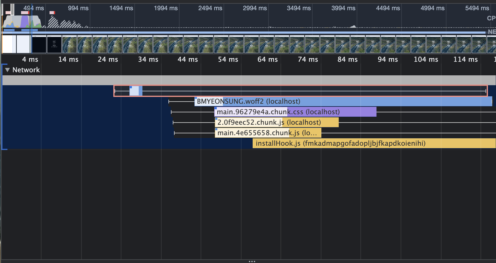

## 3-6-3) 폰트 최적화 3 (preload)

### Preload

- 미리 로드를 하는 개념

- 폰트를 preload 하는 것은 이미지를 preload하는 것과 약간 다르다

- 폰트를 preload 하는 것은 지금 폰트가 이 페이지에서 필요하기 이전 시점에,

- 그러니까 css가 로드가 되고 실행되어 css를 읽는 순간 이 폰트가 필요하다라는 것을 알게 되는데

- 그 시점 보다 더 먼저 이 페이지에서 어떤 포트가 푈요한 것을 알려주는 것이다

- 즉, css 보다 먼저 불리기 위해서는 이 폰트가 이 페이지에서 필요하다는 것을 html 파일에서 head 태그 안에 명시해주어야 한다

```html
<!-- public/index.html -->
<link
  rel="preload"
  href="BMYEONSUNG.woff2"
  as="font"
  type="font/woff2"
  crossorigin
/>
```

- App.css도 아래와 같이 수정

```css
@font-face {
  font-family: BMYEONSUNG;
  src: url('./assets/fonts/BMYEONSUNG.woff2') format('woff2'), url('./assets/fonts/BMYEONSUNG.woff')
      format('woff'), url('./assets/fonts/BMYEONSUNG.ttf') format('truetype');
  font-display: block;
}
```

- 그리고 나서 빌드한 다음 다시 실행한다

```shell

$ npm run build

```

- build 후 build/index.html 파일을 보면 추가한 태그가 있는 것을 확인할 수 있다

- 이렇게 확인한 이유는 해당 폰트가 리소스이기 때문에 웹팩에서 그대로 리소스 static으로 가져가는 것이 아니라 해쉬 값을 붙여서 가져간다

- build/static/media 에서 폰트 파일을 보면 파일 이름에 해시를 붙여서 사용하고 있다

  - BMYEONSUNG.b184ad44.woff2

- 즉, 지정해야 되는 폰트는 build/index.html의 link 태그의 href에 있는 폰트가 아니라 아니라 아래처럼 수정해주어야 한다

```html
href="./static//media/BMYEONSUNG.b184ad44.woff2"
```

- 아래처럼 명령어 사용하면 해당 디렉토리에 있는 것을 serve.js 라이브러리를 통해 서비스 한다

```shell

$ npx serve ./build

```

- 실행 후 네트워크 탭 보면 폰트 로드된 것을 확인할 수 있다

- 퍼포먼스 탭에서 다시 로드해 보면

- index.html 로드가 되자마자 (가장 위에 있는 막대기)

- 폰트는 css나 다른 js를 포함한 어떤 리소스 보다 빠르게 로드를 하고 있는 것을 확인할 수 있다



- 원래 같았으면 css가 로드가 된 후에 css가 실행되는 중간이나 로드가 끝난 시점에 부터 폰트를 로드하게 되는데

- 폰트를 preaload 해주었기 때문에 가장 먼저 로드를 하게 된다

- index.html에서 preload 하는 코드를 삭제한 다음 다시 퍼포먼스 탭에서 리로드를 하면 bundle.js 또는 chunk.js 포함되어 있기 때문에 css파일은 보이지 않지만

- 이 파일들이 로드 된 다음에 css 파일이 실행 될 때 쯤에, 뒤에서 폰트가 로드가 되는 것을 확인할 수 있다

- 이것이 폰트 preload 방법

- 다만 빌드할 때 마다 폰트 이름 때문에 index.html 파일을 수정하는 것은 말이 안된다

- 따라서 웹팩을 통해서 사용하는 폰트가 있다면 preload 하라는 방식으로 웹팩을 구성할 수 있다

- cra 사용하고 있기 때문에 react app rewired 라이브 러리를 사용한다

```shell

$ npm install react-app-rewired --save-dev

```

- 그리고 아래처럼 script 수정해준다

```json

  "scripts": {
    "start": "npm run build:style && react-app-rewired start",
    "build": "npm run build:style && react-app-rewired build",

  },

```

- 그리고 config-overrides.js 파일 추가 해준다

- 그리고 preload 할 수 있게 플러그인을 추가해준다

  - preload-webpack-plugin

```shell

$ npm install --save-dev preload-webpack-plugin@3.0.0-beta.3
# 모듈 버전 에러 있어서 다음처럼 설치한다

```

```js
/* config-overrides.js */

const PreloadWebpackPlugin = require('preload-webpack-plugin');

module.exports = function override(config, env) {
  //do stuff with the webpack config...
  config.plugins.push(
    new PreloadWebpackPlugin({
      rel: 'preload',
      as: 'font',
      include: 'allAssets',
      fileWhitelist: [/(.woff2?)/i],
    })
  );
  return config;
};
```

- 이전에 작성한 public/index.html에서 아래 코드 삭제 해준다

```html
<link
  rel="preload"
  href="BMYEONSUNG.woff2"
  as="font"
  type="font/woff2"
  crossorigin
/>
```

- 그 다음 다시 build 후 build/index.html 확인해 보면 아래처럼 폰트가 preload 되어 있는 것을 확인할 수 있다

```html
<link
  as="font"
  crossorigin="anonymous"
  href="/static/media/BMYEONSUNG.811cc009171b1b46aa63.woff"
  rel="preload"
/>
<link
  as="font"
  crossorigin="anonymous"
  href="/static/media/BMYEONSUNG.ba28895a16780ea67f38.woff2"
  rel="preload"
/>
```

- 여기사 아래와 같은 에러 때문에

```shell

[eslint] Plugin "react" was conflicted between "package.json » eslint-config-react-app" and "BaseConfig » /Users/dohyunkim/node_modules/eslint-config-react-app/base.js".

```

- package.json 에서 아래 스크립트 삭제했다

```json

  "eslintConfig": {
    "extends": "react-app"
  },


```

- 그리고 다시 아래처럼 실행한 다음 네트워크 탭 확인해보면 두 폰트 파일이 다운 받아져 있는 것을 확인할 수 있다

```shell

$ npx serve ./build

```

- 여기서는 두 폰트 모두 preload 했지만, 가장 우선이 되는 폰트만 Preload 되도록 한다

---

### Q. 혹시 @font-face {} 가 들어있는 css를 link ref="preload"하면 해당 css를 미리 불러오면서 폰트도 사전로드 되는걸까요 ?

- 아니면 폰트 사전로드는 무조건 link로 걸어줘야될까요 ?

### A. 일단 link rel = "preload" 는 브라우저의 호환성을 고려하셔야 합니다.

- 해당 css를 미리 불러오면서 폰트도 사전로드 되는겁니다.

- preload형식을 사용하게 되면, 페이지가 렌더링 되기 이전에(보여지기 이전) 페이지 로딩에 필요한 리소스(css)를 지정하게 되는겁니다.

- 이러한 점은 C,C++의 포인터와 좀 비슷한 점이 있습니다.

- 페이지 로딩에 필요한 리소스를 먼저 가져오게 됨으로써 일찍 사용할수 있으며, 페이지의 렌더링을 차단할 가능성이 낮아서 성능이 향상됩니다.

- 형식은 이와 같습니다.

```html
<head>
  <link rel="preload" href="style.css" as="style" />
</head>
```

- 질문자님이 폰트 사전로드는 무조건 링크로 걸어줘야 할까요? 라고 질문을 주셨는데

- 너무 질문이 애매모호해서 잘 이해를 못하겠습니다만, html과 css상에서는 형식을 지정해줘야 한다고 알고 있습니다.

```html
<form action="" method="post"></form>
```

- 이것과 비슷한 계열이라고 전 생각합니다.

- 왜냐하면 method형식이 기능을 가진 형식이기 때문에 선언을 반드시 해주셔야 합니다.

- 또하나 주의할점은, 너무 난발해선 안된다는것입니다.

- 오래걸리거나, 용량이 크거나, 필수로 로딩해야되는것들 위주로 몇개만 쓰셔야 성능 향상 효과를 누리실수 있습니다.

- 남발시 초반 로딩속도가 길어질수 있습니다. 참고해주시길 바랍니다.

### A. font의 preload 방식에 대해서 질문의 주셨는데요,

- 감사하게도 위에 마토님이 친절하게 답변을 달아주셨네요. :)

- 추가로 답변을 드리면,

- font가 포함된 css를 preload로 걸어서 사용하실 수 있습니다.

- 정확한 타이밍은 테스트를 해봐야 알겠지만, 당연히 css가 빠르게 로드 될거고 그에 맞춰서 font도 로드가 될겁니다.

- 다만, 주의해야할 점은 font가 로드 되려면 css 먼저 로드가 되어야 한다는 점입니다.

- 강의에서는 font를 직접 preload 했는데요, 이렇게하면 css의 로드와 상관없이 font가 우선 로드됩니다.

`<link rel="preload" href="{CSS}">`: CSS 로드 -> font 로드

`<link rel="preload" href="{font}">` : font 바로 로드

- 직접 설정을 해보고 비교해보시면 더 정확히 파악이 될 것 같습니다. ㅎ

- 그럼 답변이 도움되셨기를 바라며, 강의에 관심을 가져주셔서 감사합니다. :)

- 참고: https://developer.mozilla.org/en-US/docs/Web/HTML/Link_types/preload
