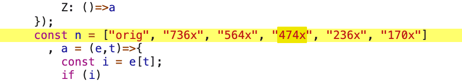

## 4-3) Layout Shift 피하기

- Network 탭에서 throttling을 6000으로 걸고 새로고침한다

- 먼저 로드된 이미지들이 나중에 로드된 이미지 때문에 뒤로 밀리는 현상 일어난다

- 바로 이게 layout shift이다

- 꼭 이미지가 아니더라도 text가 될 수도 있다.

- Performance 패널에서 리로드 해보면 Layout Shift가 잡히는 것을 확인할 수 있다

- 이런 layout shift는 성능에 영향을 준다

- layout shift가 된다는 것은 화면상에서 계산을 다시 해야한다는 것이다

- 그리고 layout shift는 사용성에 큰 영향을 준다

- 사용자가 이미지를 클릭 했을 때, 먼저 로드된 이미지를 클릭하려고 했는데 이미지가 밀림으로써ㅏ 다른 이미지가 클릭될 수 도 있다

- lighthouse에서 검사를 해보면 Cumulative Layout Shift 항목이 있는 것을 확인할 수 있다

  - 이 페이지에 총 발생하는 Layout Shift 들의 값들을 어떤 공식에 의해 계산했더니 이런 값이 나왔다는 뜻

  - 이 수치는 0부터 1까지

    - 0: Layout Shift 발생하지 않았을 때

    - 1: 모든 것이 변했을 때

  - DIAGNOSTICS 항목보면 `Image elements do not have explicit width and height`가 있다

<br/>

### Layout Shift 원인

- 아래 네가지 원인에 의해 발생할 수 있다

- 사이즈가 정해져 있지 않은 이미지

- 사이즈가 정해져 있지 않은 광고

  - 광고 같은 것들이 웹 사이트에 나타나는데, 이 광고들도 이미지를 동적으로 로드 하기 때문에 이런 광고들에 의해서 다른 요소들이 밀리면서 Layout Shift 발생

- 동적으로 삽입된 콘텐츠

- Web font (FOIT, FOUT)

  - 기본 포트 있다가 폰트가 적용되면서, 폰트의 스타일이 바뀌면서 다른 요소들을 밀어내는 현상이 생길 수 있다

### 해결 방법

- 해결 방법은 사이즈를 적용해주면 된다

  - 사이즈가 정해져 있지 않은 이미지의 경우 사이즈 정해주고

  - 사이즈가 정해져 있지 않은 광고의 경우 어느정도 광고의 사이즈를 예측해서 사이즈 정해주고

  - 동적으로 삽입된 콘텐츠 같은 경우에도 최대한 동적인 사이즈 에측해서 정해주거나 다른 것들을 밀어내지 않을 수 있는 위치에 컨텐츠를 로드하도록 한다

  - Web font의 경우에도 FOIT, FOUT가 일어나지 않도록 세팅을 해줄 수 있다

- 사이트의 이미지를 보면 이미지가 웹 사이트가 커짐에 따라 이미지의 사이즈가 변하게 된다

- 그래서 단순히 고정 값으로 이미지의 가로와 세로를 정하면 문제가 생길 수 있다

- 그렇기 때문에 비율로써 사이즈를 미리 고정해주면 된다

- 이미지 보면 16:9의 비율로 고정이 되어있다

- 그렇기 때문에 아무리 화면이 커져도 이 비율은 깨지지 않는다

- 16:9 비율로 설정을 해준다

- 이미지의 가로 사이즈는 정해져있으니까,

- 즉, 전체 웹 사이트의 가로에서 어느 정도 차지할지가 고정되어 있으니까

- 세로의 길이를 가로 대비 9만큼 고정을 해주는 방식으로 해결해준다

- 원래 코드에는 `width: 100%;`로 가로의 길이는 확보되어 있지만 세로의 길이가 없다는 것이 문제

- 이것을 해결하기 위해 아래처러 세로 값을 출가해주면 Layout Shift는 일어나지 않지만 비율이 깨져 보이는 문제가 생긴다

```js
// components/PhotoItem.js

const Image = styled.img`
  cursor: pointer;
  width: 100%;
  height: 100px;
`;
```

- 이미지를 비율을 기준으로 렌더링 해주려면 트릭이 필요하다

- 처음에 이미지 서버에서 로드할 때, 이 이미지가 정확히 어떤 사이즈를 가지는지는 실제로 로드를 한 후에 확인할 수 있다

  - 어떤 이미지는 정사각형일 수도, 어떤 이미지는 세로로 긴 직사각형일 수도, 또 다른 이미지는 가로로 긴 직 사각형일수 있다

- 그 전에는 알 수 없기 때문에 공간을 미리 확보하는 것이 불가능하다.

- 이것을 해결하기 위해서 Wrapper 역할을 하는 `ImageWrap` 태그를 활용한다

- 예를들어, 가로의 길이에 따라 세로의 길이가 정해지는 정 사각형의 box를 Wrapper로 만들어준 다음

- 그 안에다가 가로, 세로에 이미지를 꽉 채우는 방식으로 비율은 Wrapper가 알아서 해줄 거라는 식으로 처리해준다

  - 즉, ratio box인 Wrapper를 16:9로 맞춘 다음에 이미지는 그 Wrapper에 꽉 맞게 보여주는 것이다

- 아래처럼 코드를 작성해준다

- `9/16 = 56.25%` 너비의 56.25% 만큼 padding을 세팅해라

```js
const ImageWrap = styled.div`
  width: 100%;
  padding-bottom: 56.25%;
`;
```

- `Image` 태그 주석 처리 후 Element 탭에서 확인해보면 각 요소가 padding 때문에 16:9 비율로 되어있는 것을 확인할 수 있다

- 그리고 나서 `Image` 태그 주석 해제하면 컨텐츠가 추가되기 때문에 비율이 깨진다

- 따라서 absolute 속성을 사용해서 아래처럼 수정해준다

```js
const ImageWrap = styled.div`
  width: 100%;
  padding-bottom: 56.25%;
  position: relative;
`;

const Image = styled.img`
  cursor: pointer;
  position: absolute;
  width: 100%;
  height: 100%;
  top: 0;
  left: 0;
`;
```

- 이미지를 floatinge된 형태로 띄워져 있다

- 만약 아래처럼 직점 이미지에 비율을 설정하게 되는 경우 이미지 자체가 비율이 잘 안맞게 보인다

```js
const Image = styled.img`
  cursor: pointer;
  width: 100%;
  height: 56.25%;
`;
```

- 제대로 보일 때는 184 x 103로 실제로 16:9 비율이지만 코드를 수정하면 184 x 61로 비율이 안맞고 16:9도 아니고, Layout Shift도 다시 일어나게 된다

  - 이렇게 되는 이유는, PhotoItem의 부모 요소인 PhotoList 컴포넌트에서 PhotoListWrap로 스타일을 적용시켜주었기 때문에 PhotoItem의 ImageWrap 에서 width값이 100%로 했을 때 width 값이 정해지고 그것에 따라 `padding-bottom: 56.25%;`이 정해져서 16:9 비율의 Wrapper가 만들어지지만

  - 그냥 이미지에서 바로 `width: 100%`와 `height:56.25%;`를 하면 정확한 이미지의 크기를 로드 되기 전에 알 수 없기 때문에 Layout Shift도 일어나고 16:9도 정화갛게 계산이 되지 않는 것 같다

- 그리고 Performance 패널에서 다시 확인해보면 이 전에 Layout Shift가 발생했던 부분에서 Layout Shift가 더 이상 발생하지 않은 것을 확인할 수 있다

- Lighthouse에서도 다시 측정을 해보면 Cumulative Layout Shift 값이 0으로 줄어든 것을 확인할 수 있다

---

### Q. 질문이있습니다. 보여주신 예제는 전부 동일한 이미지일때인데

- 각 이미지마다 사이즈가 다른 갤러리에서는 어떻게 적용하면 좋을까요 ?

- 예를들어 이런 사이트의 형식입니다. https://www.pinterest.com/seanbiehle/finterest/

### A. 이미지 사이즈(비율)가 제각각인 경우 layout shift를 피하는 방법에 대해서 질문을 주셨는데요,

- 스태틱한 이미지는 자체 사이즈를 알 수 있으니 생략하고 api를 통해 이미지 주소를 전달받은 경우에 대해서 말씀드리겠습니다.

- 이런 경우 몇가지 방법들을 생각해볼 수 있을 것 같은데,

- 먼저, api에서 이미지 주소를 받을 때, 이미지 사이즈도 같이 전달 받는 방식입니다.

- 클라이언트에서는 api에 있는 가로, 세로 정보로 비율을 계산해서 영역을 잡아줄 수 있습니다.

- 두 번째 방법은, 첫 번째 방법과 유사한데,

- 이미지 주소에 비율 또는 사이즈에 대한 정보를 명시해주는 겁니다.

- www.img.co/100x100/a1b2c3d4.png

- 이런식으로 말이죠.

- 예를 들어주신 핀터레스트의 경우 위의 두 번째 방법을 사용하고 있습니다.

  - https://i.pinimg.com/474x/bb/f2/5d/bbf25d30ce75971f2f8ba531c51d2eae.jpg



- 이미지 주소가 위와 같은데 여기서 474x가 비율에 대한 정보인 것으로 보입니다.

  - (네트워크 패널에 잡히는 js들에서 검색했을 때, 해당 코드들이 해당 키에 대한 이미지 정보를 가져오는 부분으로 추측됩니다.)

- 그 외에도 몇가지 방법이 더 있겠지만, 지금 생각나는 것은 이것 뿐이네요.

<br/>

### Q. lighthouse 측정에 관해 질문드려요

- 퍼포먼스 관련 작업 하던중에 잘 모르는게 생겨 질문드립니다

- 강의 완강하고나서 알려주신것들로 여러가지 해보니 실제로 lighthouse쪽은 굉장히 점수가 향상됐는데요.

- 이 작업이 이루어진 프로젝트는 next를 이용하고있어서 배포를 vercel를 통해 했습니다.

- 근데 vercel쪽에서 집계된 Analytics기능에서 측정된 지표는 lighthouse와 차이가 좀 많이 나네요.

- 개발모드까지 같이 측정했나 확인해보니 그건 아닌것같습니다.

- 페이지마다 살펴보니 vercel쪽의 데이터들은 FCP와 LCP지표가 상당히 높게 나타나는데 혹시 vercel쪽에서 측정되는 analytics 서버의 네트워크 환경에 따라 이렇게 될수도 있는걸까요?

- vercel의 서비스중에 https://vercel.com/docs/concepts/functions/serverless-functions/regions

- 이 있는데 한국대상 서비스이기 때문에 이 설정을 한국으로 설정했거든요.

- 질문을 좀 정리해보자면

  1. 개발하고나서 배포를했을때 light house측정을 이전 내역들을 날리고 "clean"한 상태에서 측정 하는 다른 방법이 있을까요? 현재는 시크릿탭에서 network탭의 "disabled cache"만 체크해두고 측정마다 캐시 강력 새로고침으로 하고 있습니다.

  2. 퍼포먼스 탭에서도 위 질문같은 방법이 있는지 궁금합니다.

  3. lighthouse말고 혹시 신뢰성있는 다른 방법도 있을까요?

### A.

1. 라이트하우스는 기본적으로 이전 내역과 관계없이(캐시없이) 실행됩니다. 예전에는 다른 패널에서 설정한 옵션(throttle, disable cahce 등)이 반영된 상태로 실행됐는데, 최근 업데이트된 라이트하우스는 다른 패널들의 옵션과 관계없이 기본값으로 설정된 옵션으로 실행됩니다.

따라서, 따로 캐시를 비워주실 필요는 없습니다.

2. performance 패널에서는 각 패널에서 설정한 옵션들이 적용됩니다. 즉, 네트워크 패널에서 disable cache를 적용한 뒤 performance 검사를 하면 캐시가 없는 상태로 실행이 됩니다.

3. 성능 점수는 측정 환경과 방법에 따라 많이 차이가 생깁니다. 때문에 지속적인 서비스 성능 측정을 위해서는 그 기준을 동일하게 맞춰두는 것이 좋습니다.

- 제가 vercel의 Analytics 기능을 써보지 않아서 정확히 알긴 어렵지만, 찾아보니 RUM(Real User Monitoring) 방식으로 보입니다. 즉, 서비스가 제공되는 중에 실제 유저의 활동기록을 기반으로 성능 측정을 한 것입니다.

- 그에 반해 라이트하우스를 이용한 측정 방식은 Synthetic Monitoring 이라고 해서, 제한된(simulated) 환경에서 성능을 측정하는 방식입니다. 그렇기에 당연히 다를 수 밖에 없습니다.

- 특히 라이트하우스로 검사하는 경우 설정한 옵션(throttle 등)에 따라서도 달라질 수 있으므로 고정된 환경에서 측정 및 비교해야합니다.

- 이 설정은 RUM에서 측정된 통계를 기반으로 적정선을 찾아서 적용하는 것이 좋습니다.

- RUM 관련해서 P75, P90 개념을 찾아보시면 도움이 되실겁니다.

  - (가장 이상적인 방법은 두가지를 모두 적용해서 실제 유저의 통계와 랩 환경의 점수를 함께 보는 것입니다.)

- 결론적으로 질문에 답을 다시 하면, 라이트하우스는 제한된 환경(네트워크 느리게하고 CPU 느리게하고, 캐시 날리고)에서 검사를 하기 때문에 점수가 낮을 수도 있습니다.

- 그에 반해 Vercel Analytics(RUM)의 경우 실제 유저를 기반으로 하기 때문에 빠른 환경의 유저에게는 높은 점수가 찍힐거고, 느린 환경의 유저에게는 낮은 점수가 찍힐 겁니다.

- 결국 이 데이터가 쌓이면 유저의 평균 LCP 등을 알 수 있는거죠.

```

```
