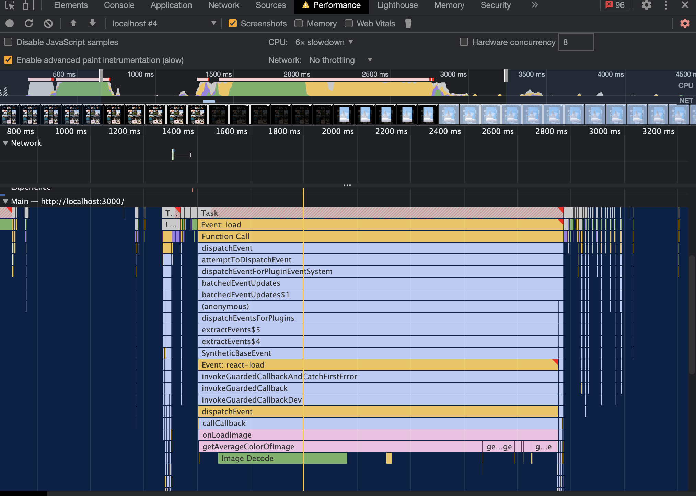

## 4-7) 병목 함수에 memoization 적용

- 메모이제이션이란 어떤 로직이 있을 때, 인풋에 따라서 아웃풋이 나오는 로직 대해 미리 값을 저장해 두는 방법

- 다음번에 같은 인풋이 들어오면 로직을 실행하는 것이 아니라 지난번에 저장한 값을 아웃풋으로 내보내는 방법이다

- 로직이 빈번하게 발생하고 시간이 많이 걸리고, 인풋이 동일한 값들이 주로 들어온다면 굉장히 효율적인 기법이 될 수 있다

- 이미지 클릭해서 나타나는 것을 개선한다

- 이미지 자체는 크기를 줄이지 않는 이상 다운로드 속도는 네트워크 환경에 따라 다르기 때문에 따로 해결할 수 있는 부분은 없지만

- background를 로직을 개선할 수 있다

- 이미지가 나타나고 배경 색깔이 바뀌는데 약간의 딜레이가 있다

  - 이 부분을 최적화 한다

- 크게 두가지 방법이 있는데

- 하나는 배경색이 나타나는 시간을 단축시키는 것

  - 계산 로직을 짧게 단축

- 두번째는 로직 자체를 수정할 수 없는 경우, 한번 들어간 이미지에 대해서는 저장해놓고

  - 두번째 들어온 경우에는 바로 렌더링 할 수 있게 만드는 방법이 있다

- 메모이제이션의 단점은 최초의 계산은 느릴 수 있다

- 저장된 값이 없기 때문

- 퍼포먼스 탭에서, CPU를 6xslowdown 처리 후 recoding 하면서 이미지를 클릭해본다

- stop해서 보면 Main 항목에서 로직을 확인할 수 있다

- 이미지가 다운로드 받는 것을 Network 항목에서 확인할 수 있고,

- onload 함수를 등록해 놓았기 때문에 이미지를 다운로드 받자마자 onload 함수가 실행되는 것을 Main 항목에서 Event:load 항목을 통해서 확인할 수 있다.

- 해당 부분이 굉장히 오래 걸린 것을 확인할 수 있다

- 특히 getAverageColorOfImage가 실행되는데 굉장히 오래걸렸다



- getAverageColorOfImage가 분석해야 하는 함수

  - utils 폴더에 있다

- 아래는 메모이제이션 적용한 코드

```js
// utils/getAverageColorOfImage

// getAverageColorOfImage 안에 정의하면 매번 초기화 되기 때문에 밖에 선언한다

const cache = {};

export function getAverageColorOfImage(imgElement) {
  // 이전에 계산한, 캐시된 값 있으면 그 값을 리턴한다
  if (cache.hasOwnProperty(imgElement)) {
    console.log('cache have the key');

    return cache[imgElement];
  }

  /**
   * 이미지가 픽셀로 구성되어 있는데
   * 각 픽셀의 컬러가 무엇인지 RGB 계산해서, 해당 값들에 대한 평균을 구한다
   */

  console.log('cache do not have the key');

  const canvas = document.createElement('canvas');
  const context = canvas.getContext && canvas.getContext('2d');
  const averageColor = {
    r: 0,
    g: 0,
    b: 0,
  };

  if (!context) {
    return averageColor;
  }

  const width = (canvas.width =
    imgElement.naturalWidth || imgElement.offsetWidth || imgElement.width);
  const height = (canvas.height =
    imgElement.naturalHeight || imgElement.offsetHeight || imgElement.height);

  context.drawImage(imgElement, 0, 0);

  const imageData = context.getImageData(0, 0, width, height).data;
  // Performance 탭에서 확인했듯이 getAverageColorOfImage 아래있는 getImageData 함수도 오래 걸렸다
  // 하지만 getImageData는 context에 있는 함수이기 때문에 수정 불가
  // 따라서 메모이제이션 기법을 적용한다
  const length = imageData.length;

  for (let i = 0; i < length; i += 4) {
    averageColor.r += imageData[i];
    averageColor.g += imageData[i + 1];
    averageColor.b += imageData[i + 2];
  }

  const count = length / 4;
  averageColor.r = ~~(averageColor.r / count); // ~~ => convert to int
  averageColor.g = ~~(averageColor.g / count);
  averageColor.b = ~~(averageColor.b / count);

  cache[imgElement] = averageColor;

  return averageColor; // 평균을 객체 형태로 반환한다
}
```

- 메모이제이션 적용할 수 있는 함수는

  - 순수 함수 여야 한다

  - 즉, 동일한 인풋에 대해서 동일한 아웃풋이 나오는 함수여야 한다

  - 그래야지 캐시가 의미가 있다

    - 예를들어 1이 인풋으로 들어왔을 때 랜덤한 값이 리턴된다면 안된다

- 코드 실행해서 이미지 클릭하면 처음에는 `cache do not have the key` 나타나지만

- 같은 이미지 다시 클릭하면 `cache have the key` 라는 로그 출력된다

- 하지만 다른 처음 클릭하는 이미지 클릭해도 `cache have the key` 라는 로그가 출력되고 아까 클릭한 이미지의 백그라운드 컬러가 나타난다

- 그 이유는 `cache[imgElement]`의 imgElement가 img 태그인 HTMLImageELement이기 때문에

- 다른 이미지 클릭해도 인풋인 imgElement 값 HTMLImageELement로 비교를 했기 때문에 같다고 판단을 한 것이다

- 이것을 해결하는 방법은 각 이미지들을 구분할 수 있는 고유한 값을 key로 사용한다

- 바로 `src='url'`인 url을 키로 사용한다

- 아래와 같이 코드를 수정해주면 정상적으로 작동한다

```js
// utils/getAverageColorOfImage

const cache = {};

export function getAverageColorOfImage(imgElement) {
  // src로 비교
  if (cache.hasOwnProperty(imgElement.src)) {
    console.log('cache have the key');
    return cache[imgElement.src];
  }

  console.log('cache do not have the key');

  const canvas = document.createElement('canvas');
  const context = canvas.getContext && canvas.getContext('2d');
  const averageColor = {
    r: 0,
    g: 0,
    b: 0,
  };

  if (!context) {
    return averageColor;
  }

  const width = (canvas.width =
    imgElement.naturalWidth || imgElement.offsetWidth || imgElement.width);
  const height = (canvas.height =
    imgElement.naturalHeight || imgElement.offsetHeight || imgElement.height);

  context.drawImage(imgElement, 0, 0);

  const imageData = context.getImageData(0, 0, width, height).data;

  const length = imageData.length;

  for (let i = 0; i < length; i += 4) {
    averageColor.r += imageData[i];
    averageColor.g += imageData[i + 1];
    averageColor.b += imageData[i + 2];
  }

  const count = length / 4;
  averageColor.r = ~~(averageColor.r / count); // ~~ => convert to int
  averageColor.g = ~~(averageColor.g / count);
  averageColor.b = ~~(averageColor.b / count);

  cache[imgElement.src] = averageColor; // src 사용한다

  return averageColor;
}
```

- 다시 Performance 탭을 통해서 확인하면 getAverageColorOfImage 함수가 굉장히 짧아진 것을 확인할 수 있다

- 현재는 해당 함수 하나만 메모이제이션을 위해 캐시를 적용해주었지만

- 함수가 여러개 인 경우에는 각각 캐시를 만들어주어야 한다면 굉장히 번거러울 것이다

- 그럴 때는 팩토리 패턴을 사용해서 함수 자체에 메모이제이션이 적용된 함수를 만들어줄 수 있다

```js
// utils/memoize.js

function memoize(fn) {
  const cache = {};

  // 어떤 argument를 받을 지 모른다
  return function (...args) {
    if (cache.hasOwnProperty(args)) {
      return cache[args];
    }

    const result = fn(...args);

    cache[args] = result;

    return result;
  };
}

// 위처럼 코드 작성해면 아래처럼 동일하다
// memoize(getAverageColorOfImage)(img) === getAverageColorOfImage(img)
```

- 아래처럼 에러 나오지 않도록 코드를 수정했다

```js
export default function memoize(fn) {
  const cache = {};

  // 어떤 argument를 받을 지 모른다
  return function (...args) {
    // 여기서 args는 배열로 몇개의 인자가 전달될지 모른다
    // 그리고 배열 객체이기 때문에 들어올 때 마다 [a,b,c,d] 처럼 동일해도 객체 값이 바뀌면서 다른 값으로 인지한다
    // 그렇기 때문에 인자가 하나가 아니면 아래처럼 처리할수 있도록 방어 코드를 작성한다
    if (args.length !== 1) {
      return fn(...args);
    }

    const imgSrc = args[0].src;

    if (cache.hasOwnProperty(imgSrc)) {
      return cache[imgSrc];
    }

    const result = fn(...args);

    cache[imgSrc] = result;

    return result;
  };
}

// 위처럼 코드 작성해면 아래처럼 동일하다
// memoize(getAverageColorOfImage)(img) === getAverageColorOfImage(img)
```

- 메모이제이션도 기회비용 있다

- 메모리가 많이 들기 때문

- 그렇기 때문에 인풋 값이 매번 달라지는 로직이 있다면 거기에는 메모리가 적절하지 않다

- 인풋을 다시 사용하지도 않을 것인데 캐시를 하면 메모리가 낭비되기 때문

- 메모이제이션 사용했을 때 가장 효율적인 경우는 반복적으로 동일한 인풋 값이 들어오는 함수

- 로직 자체가 굉장히 헤비한 함수에 메모이제이션 기법이 효율적이다

- 메모이제이션도 결국에는 첫 계산에서는 로직이 실행되기 때문에 느릴 수 있기에 해당 로직도 최적화 할 수 있도록 한다
